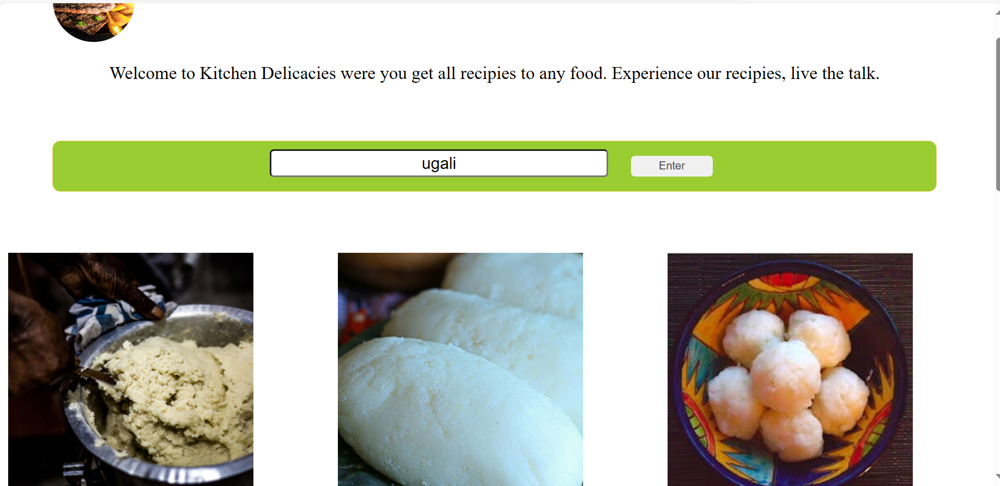

# PHASE-1 PROJECT
## PROJECT DESCRIPTION
A web application which aids user to search a receipe of their wish, and return ouptut in terms of ingredients,and cooking procedure.
## Technologies Used
```
Git v.2.42.0
```
```
Vscode
```
```
HTML/CSS/BOOTSTRAP/JAVASCRIPT
```

## Setup
1. Git clone to your local machine via ssh key ```git@github.com:John-Mwau/Phase1-Project.git```
2. Test the code using live server or a browser in your local machine.
3. Demo to my project


## Author & License
John Mwau & [MIT LICENSE](LICENSE)
